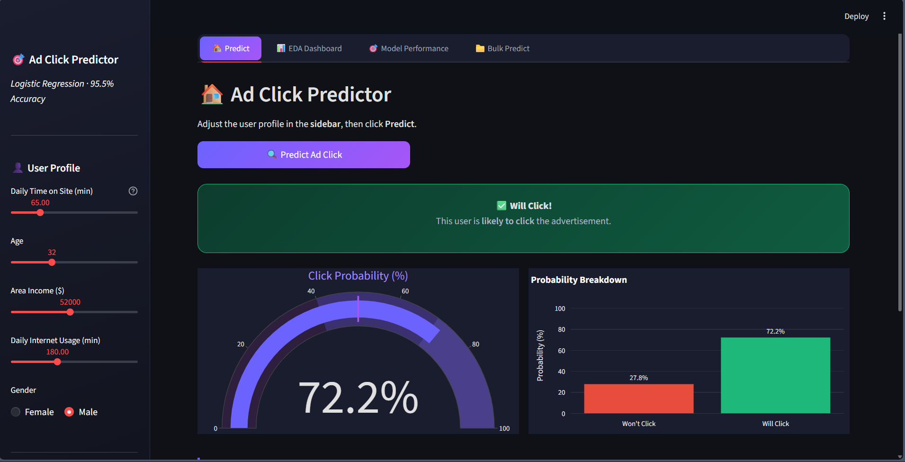
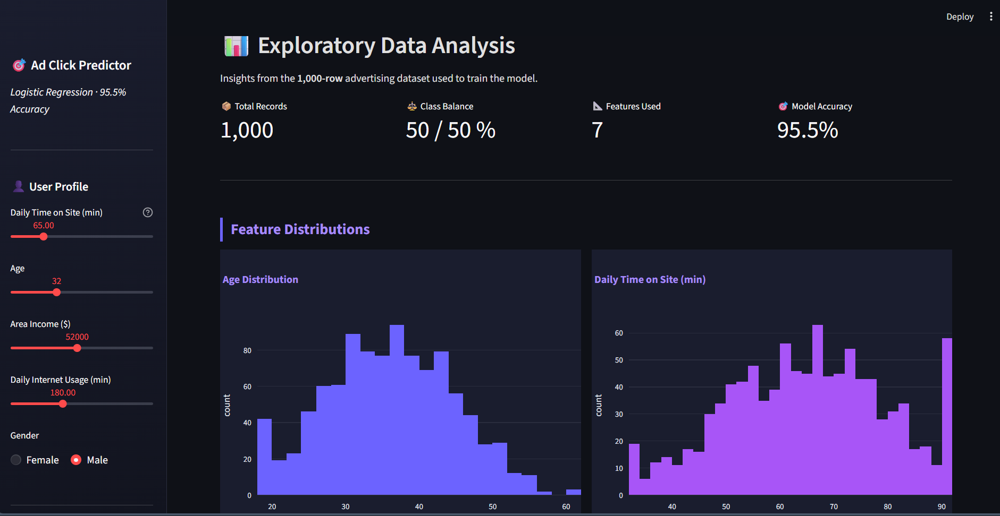
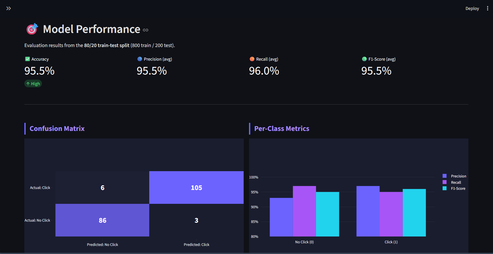

# 🎯 Ad Click Prediction Dashboard

A premium, interactive web application built with **Streamlit** that predicts user advertisement click behavior with **95.5% accuracy**. The project includes a complete ML pipeline from data exploration (EDA) to model deployment using Logistic Regression.

## 🚀 Features

- **🏠 Interactive Predictor**: Get real-time predictions based on user profiles.
- **📊 EDA Dashboard**: Visual representation of the 1,000-record training dataset.
- **🎯 Model Performance**: View model metrics (Accuracy, Confusion Matrix, ROC Curve).
- **📁 Bulk Prediction**: Upload CSVs for batch predictions.

---

## 📸 Screenshots

| Prediction Tab | EDA Dashboard | Model Performance |
| :---: | :---: | :---: |
|  |  |  |

---

## 🛠️ Setup & Run

### 1. Prerequisites
- **Python 3.8+**

### 2. Installation
```bash
# Clone the repository & navigate inside
cd "Ad click prediction"

# Create and activate a virtual environment (Recommended)
python -m venv venv
venv\Scripts\activate  # Windows
# source venv/bin/activate  # Mac/Linux

# Install dependencies
pip install -r requirements.txt
```

### 3. Usage
```bash
streamlit run app.py
```
App opens at `http://localhost:8501`.

---

## 📂 Project Structure

```
├── app.py                  # Main Streamlit application entry point
├── src/                    # Source code modules
│   ├── ui.py               # Theme and styling configuration
│   ├── utils.py            # Model loading and prediction logic
│   └── tabs/               # Individual tab components
│       ├── predict.py      # Tab 1: Interactive prediction
│       ├── eda.py          # Tab 2: Exploratory Data Analysis
│       ├── performance.py  # Tab 3: Model metrics
│       └── bulk_predict.py # Tab 4: CSV batch prediction
├── data/                   # Dataset directory (add your dataset here)
├── models/                 # Pre-trained models (.pkl files)
├── notebooks/              # Jupyter notebooks for model training
└── images/                 # Documentation screenshots
```

---

## 🧠 Model Info
- **Algorithm**: Logistic Regression
- **Accuracy**: 95.5%
- **Key Predictors**: Daily Internet Usage, Daily Time Spent on Site, Area Income.
